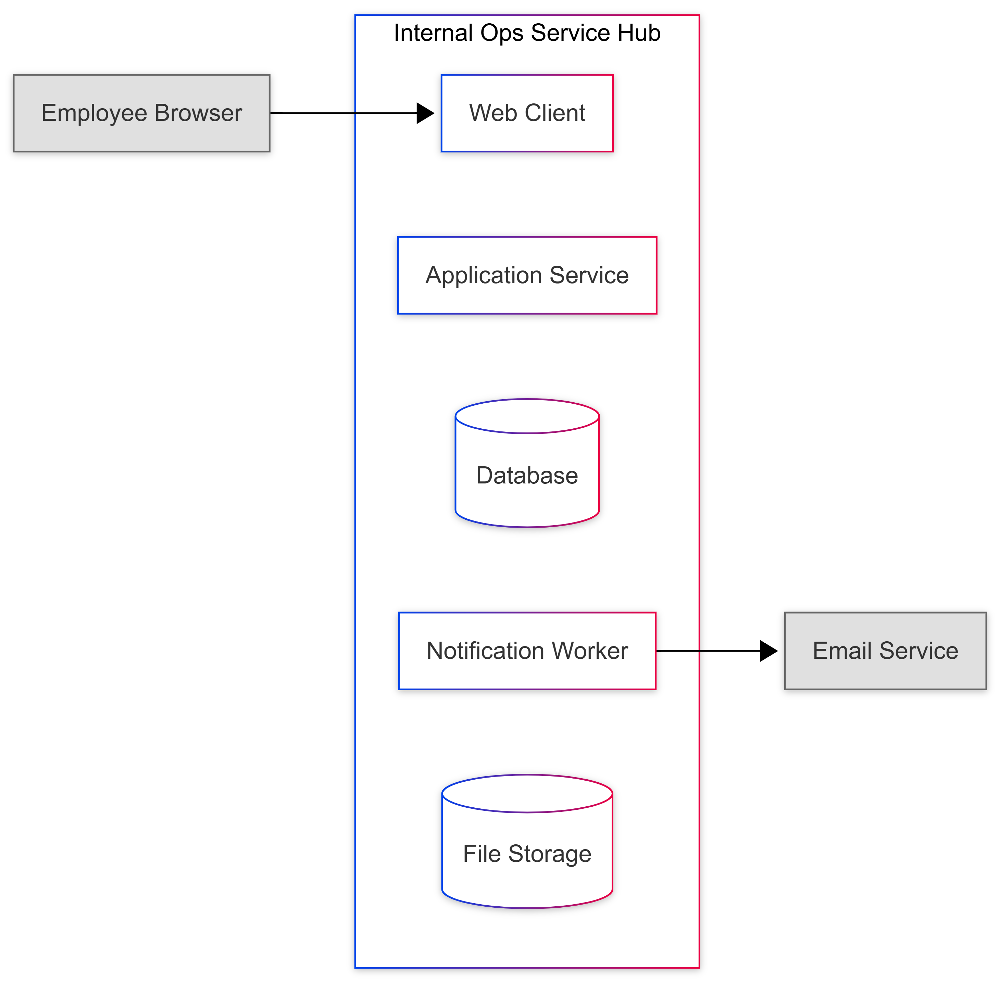
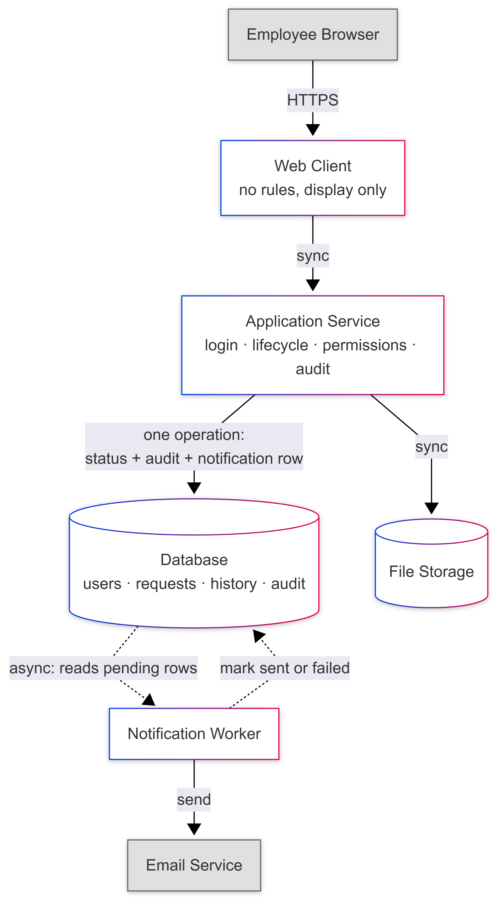
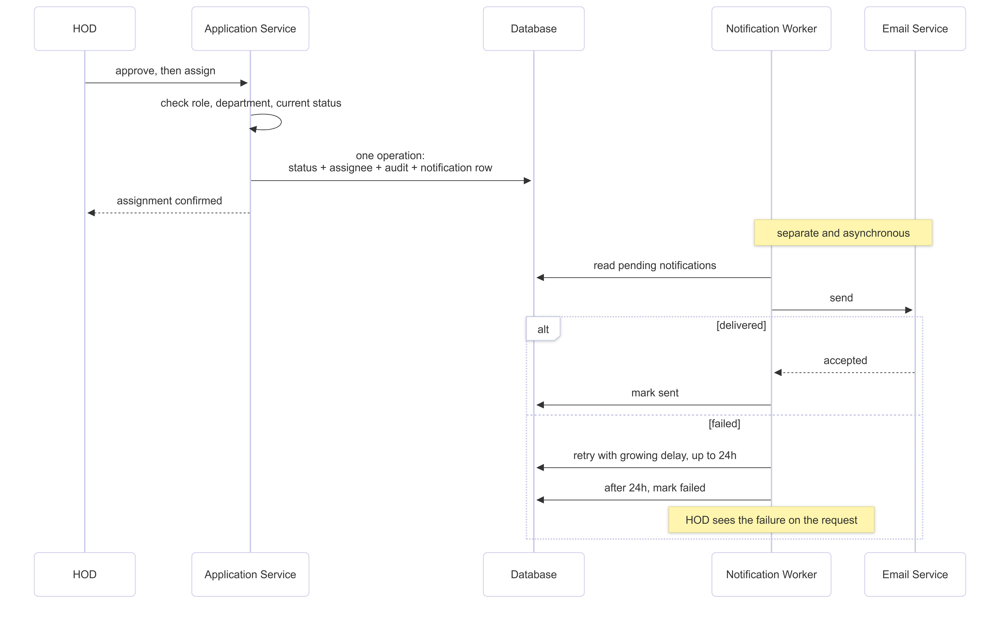
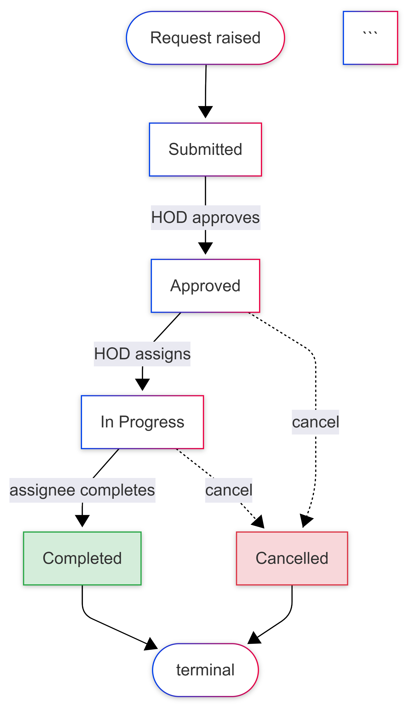

# Architecture: Internal Operations Service Hub

Companion to `product-spec.md`. Explains what the system is made of, why each part exists, how information moves, and what happens when something breaks.

Not covered here: code, database tables, endpoints, deployment setup.

---

## 1. What Drives This Design

Five things in the spec shape every decision below.

| A request must be approved before it can be assigned, and Completed is final | The rules live on the server, in one place |
| People see only what their role allows | The system decides visibility before it fetches any data |
| Email failure must not block work | Sending email is separated from doing the work |
| Nothing gets silently lost | Every change is saved together with its audit record |
| The system integrates with nothing | Accounts and logins are built into the product |

**Scale.** 200 people using it at once, 99.5% uptime in business hours, pages loading in two seconds. This is a small system, and that matters as much as the requirements do.

---

## 2. What Is Inside and What Is Outside

**Inside the system, we build and control these:**

- Web client
- Application service
- Database
- Notification worker
- File storage

**Outside the system, we depend on these but do not control them:**

- The employee's browser
- The email service

Because we build everything from scratch, the only outside thing we rely on is email. And email is a secondary channel by design, so it can fail without the product failing.

---

## 3. The Parts and Why Each Exists

| Web client | Shows the interface | Users need somewhere to work. It holds no rules |
| Application service | All the rules: login, lifecycle, permissions, audit | The rules must live in exactly one place |
| Database | Stores users, requests, history, audit log | The data and the rules are both relational |
| Notification worker | Sends emails and retries failures | So email failure never blocks assignment |
| File storage | Holds attachments | Files do not belong inside a transactional database |

Inside the application service there are modules, not separate services: login and sessions, requests and lifecycle, assignment, permissions, configuration, reporting. Separate responsibilities, same deployment.

#### What we chose not to build

| SSO with an external provider | Nothing exists to connect to. See ADR-4 |
| Message queue like Kafka | We have one background job at a few hundred emails a day. A database table read by a worker does the same thing |
| Cache like Redis | Small dataset, indexed queries, 200 users. There is no slow query to cache |
| Microservices | One workflow, one team, one scale. Splitting it would turn simple checks into network calls that can half-fail |

Each of these can be added later if there is evidence for it. None is justified today.

---

## 4. How Information Moves

#### Logging in

The user enters their credentials. The application service checks them against the stored account and creates a session. If the login fails, the message is the same whether the account exists or not, so nobody can use the login page to find out who works here.

Every later action uses the identity from that session. The system never trusts what the browser claims.

#### Raising a request

1. The requester fills the form and submits
2. The service checks permissions, then checks the required fields for that topic
3. The request is saved as Submitted, together with its first audit entry, in one operation
4. If anything fails, nothing is saved, and the form keeps what the user typed
5. The request appears in the department queue within five seconds

Attachments go to file storage first, and the request stores a reference to them.

This is synchronous because the requester needs to know the request exists before leaving the page.

#### Approving and assigning

Before anything changes, the service checks three things:

- The person acting is the head of that department
- The chosen assignee belongs to that department
- The current status allows this change

If all three pass, one operation saves: the new status, the assignee, the audit entry, and a notification row.

**The notification row is saved in the same operation as the status change.** This is the key detail. It means the intention to send an email becomes permanent at the exact moment the assignment becomes permanent. The email can never be lost because the system crashed in between, and can never be sent for an assignment that failed.

#### Sending the email

The worker picks up pending notification rows and sends them.

- Sent successfully, the row is marked sent
- Failed, it is retried with a growing delay
- Still failing after 24 hours, it is marked failed, shown on the request, and reported to administrators

This runs separately from the assignment that caused it. That separation is what makes the "email never blocks work" requirement actually true.

#### Rerouting

The request enters the new department as Submitted, but keeps its original submission time so reporting shows when the employee actually asked. The reason is added to the history.

#### Reading a queue

Permissions are resolved before any data is fetched. A confidential request is left out of the query itself. It is never loaded and then hidden. It is never loaded.

---

## 5. Request Lifecycle

| New request created as Submitted | Requester | Required fields are filled |
| Submitted to Approved | HOD | They head that department |
| Approved to In Progress | HOD | The assignee is in that department |
| In Progress to Completed | Assignee | They are the assignee |
| Anything to Cancelled | HOD any time before Completed, requester only while Submitted | A reason is recorded |

Completed and Cancelled are final. Any other change is rejected by the server with an explanation.

---

## 6. Where Trust Checks Happen

| Browser to application service | Everything: claimed identity, request id, target status, chosen assignee | Every action is checked on the server against the real session and the real current state |
| Login | The submitted credentials | Verified against the stored account, with an identical error either way |
| Session to any action | That the account is still valid | Every action rechecks the account is active and still has that role |
| Application service to email | The content leaving the system | Confidential requests send only a link, no details |
| Application service to file storage | A leaked file path | Files are served through the service, so they inherit the request's permissions |

Hiding a button in the interface prevents a mistake, not an attack. The server is the only thing enforcing anything.

**One consequence of building login ourselves:** the application service is the only thing between a stranger and every request in the system. Password storage and session handling become our responsibility permanently. That trade is explained in ADR-4.

---

## 7. What Happens When Things Fail

| **Email service** | The worker, when sending fails | Nothing unusual. The assignment worked and the request is workable | Everything | Every attempt. Repeated failure reported to admins |
| **File storage** | On upload or download | "Attachments unavailable" | The request can still be submitted and opened | Failures logged |
| **Database** | On any operation | A clear error, with form content kept | Nothing. This is correct | Logged |

**Why the database has no fallback.** It is the system's memory, not a helper. The spec promises a request is either created and visible or visibly failed. Accepting something we cannot save would break that promise.

**Why this list is short.** We depend on one third party, and it is designed to fail harmlessly. Everything else is ours, which means we can test it instead of hoping.

#### Duplicates and out-of-order messages

| The same email sent twice | The email service received it but the confirmation was lost, so the worker retried | Each notification has an id and is claimed before sending, so a retry recognises it |
| The same request created twice | The user resubmitted the form | Same approach, and it matters more here than a duplicate email does |
| Emails arriving out of order | Email does not guarantee order | Emails carry a **link, not a status**. The system is the only source of what is true now |
| Two people acting at once | Both open the same request | The second action is checked against the current state and rejected if it moved, showing the actor what is actually true |

---

## 8. Scale and Reliability Notes

- 200 users on indexed queries is small. One instance handles it. To grow, add more instances behind a load balancer, which works as long as sessions are in the database rather than in memory.
- **The database is the single point of failure**, and it holds accounts as well as requests. Automated backups and a restore procedure that has actually been tested are proportionate at this scale.
- Reporting queries will be the first thing to slow down as three years of history builds up. Fix it with indexes, then precomputed summaries. Not a cache.
- Attachments are the only storage that grows without limit.
- The worker falling behind means slower email and nothing else. That is exactly why it is separate.

---

## 9. Decisions

#### ADR-1 · One service, not microservices

**Problem.** How to divide the logic.
**Options.** Separate services per area, or one service with internal modules.
**Decision.** One service, internally modular.
**Cost.** Everything scales together, and the module boundaries are a convention the team has to maintain. Worth it because the rules cannot be bypassed through another path, and a small team can actually run it. If a part needs to scale separately later, the modules are where it splits.

#### ADR-2 · Relational database

**Problem.** How to store accounts, requests, history, and the audit log.
**Options.** Relational, or document store.
**Decision.** Relational.
**Cost.** Schema changes need migrations, and topic-specific form fields fit awkwardly. Worth it because the rules can be enforced in the data itself, a status change and its audit entry save together, and reporting queries are natural.

#### ADR-3 · Save the notification with the status change, send it later

**Problem.** Email must never block work, and must never be lost.
**Options.** Send during assignment. Fire into a queue after saving. Save the intent in the same operation, send afterwards.
**Decision.** Save the intent in the same operation.
**Cost.** Emails arrive a little later, and we run a worker with retry logic. Worth it because assignment never waits on the one outside system we depend on, and a notification cannot be lost to a crash or sent for something that failed. Sending inline would tie our core action to our least reliable dependency. Fire and forget would lose emails exactly when things are going worst.

#### ADR-4 · Build login into the product

**Problem.** Where identity lives, given we integrate with nothing.
**Options.** SSO with a company identity provider. Run our own identity provider such as Keycloak. Build accounts and login into the application service.
**Decision.** Build it into the application service.
**Why not SSO.** SSO means redirecting the user to a provider that already holds every employee. There is no such provider here, so there is nothing to redirect to. SSO cannot be built from scratch, because the thing it depends on is exactly what "from scratch" removes.
**Why not our own provider.** Keycloak would give real SSO, but it is another component to run, configure, and secure, for a benefit we cannot use yet since there is no second application to sign into.
**Cost.** We own password storage, sessions, and account lifecycle permanently. A departing employee keeps access until an administrator disables their account, which a company directory would have done automatically. That risk is noted as an assumption in the spec. Login is kept as its own module, so switching to a provider later changes one module rather than the whole service.

#### ADR-5 · The page asks; the server does not push

**Problem.** How the screen reflects a change made by someone else.
**Options.** Poll every few seconds. Keep a WebSocket open. Use webhooks. Just fetch when the user navigates.
**Decision.** Fetch when the user navigates.
**Cost.** Someone watching a page sees the change only after refreshing. Worth it because a request changes status a handful of times over days, and email already covers the moments that matter. Polling would create constant load for state that barely moves. A WebSocket would add connection handling and message ordering to solve a problem we do not have. Webhooks do not apply, since no outside system pushes anything to us.

#### ADR-6 · Attachments outside the database

**Problem.** Where uploaded files go.
**Options.** In the database, or in file storage with a reference.
**Decision.** File storage.
**Cost.** A second place to write and an extra failure mode, handled by letting a request proceed without its attachment. Worth it because the database stays small, so backups stay fast and queries stay predictable over three years. Files are still served through the service so they inherit the request's permissions.

#### ADR-7 · No cache for now

**Problem.** Whether to add a cache in front of the database.
**Options.** Add it now, or add it when something is measurably slow.
**Decision.** Not now.
**Cost.** If reporting slows down later, we fix it then instead of already having it. Worth it because caching a query nobody has measured is guessing, and a cache adds a second version of the truth to a product whose entire job is telling people the current state of their request.

---

## 10. Traceability

| One service, rules on the server | Approval gates assignment; Completed is final; invalid changes rejected |
| Notification saved with the status change | Email failure must never block work |
| Login built into the product | The system integrates with nothing existing |
| Permissions owned by the system | Role-based visibility and confidential topics |
| Status and audit saved together | The audit log must be unchangeable |
| Original submission time kept on reroute | Routing requirements |
| No queue, no cache, no microservices | The stated scale and the small-team constraint |

#### What would change this design

Each of these follows from an unknown in the spec.

- **The company adopts a central identity provider.** Login moves out of the product and account maintenance goes with it. ADR-4 is written so this replaces one module.
- **Comments or chat get added.** Reopens ADR-5, and a chat platform becomes a second outside dependency with its own failure analysis.
- **Automatic assignment gets added.** Rule evaluation joins the lifecycle and has to appear in the audit log, so the requester can tell automatic from manual.
- **Approval from another department gets added.** The lifecycle stops being a straight line and gains a second decision owner.
- **Volume turns out much higher than estimated.** Reporting slows first, and ADR-7 is the first decision to revisit.